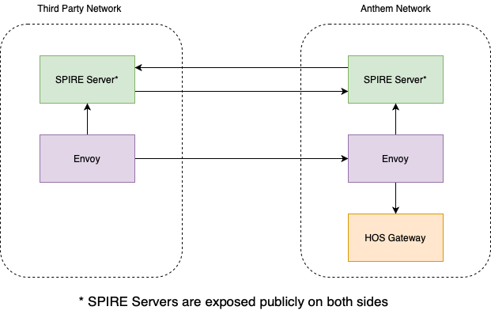

Any third party that wishes to federate with the Anthem HOS Application needs to run SPIRE within their environment.

These requirements must be met before Federation work can begin:
- Linux Environment
- Docker or Kubernetes
- Persistent Storage (PVC if Kubernetes)
- The ability to expose TCP services (not HTTP/Layer 7)
 
In this repo, we have `Docker` and `Kubernetes` labs for federating with HOS.

